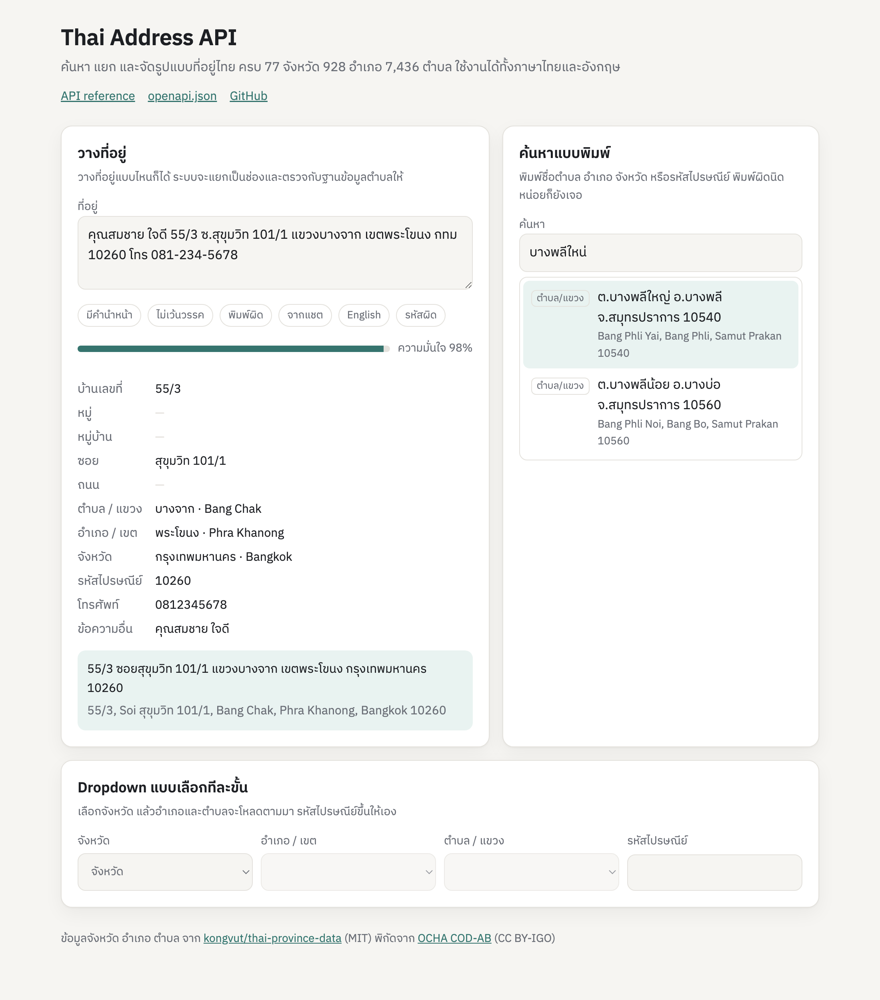

# thai-address-api

[English](README.md) | ภาษาไทย

[](https://github.com/nuttakulsv/thai-address-api/actions/workflows/ci.yml)
[](https://www.npmjs.com/package/thai-address-api)
[](LICENSE)

ข้อมูลจังหวัด อำเภอ ตำบล และรหัสไปรษณีย์ครบทั้งประเทศ พร้อมตัวแยกที่อยู่ที่รับข้อความแบบ `99/1ม.4ต.บางพลีใหน่อ.บางพลีจ.สมุทรปราการ10540` แล้วคืนค่าเป็นช่อง ๆ ที่ตรวจกับฐานข้อมูลแล้ว ใช้เป็น npm library แบบ offline ก็ได้ หรือรันเป็น HTTP API ก็ได้

[](https://nuttakulsv.github.io/thai-address-api/)

**[ลองในเบราว์เซอร์](https://nuttakulsv.github.io/thai-address-api/)** หน้า demo นี้รันอยู่ในหน้าเว็บทั้งหมดด้วย library ที่ bundle ไว้ ไม่มีเซิร์ฟเวอร์อยู่เบื้องหลัง ที่อยู่ที่พิมพ์จึงไม่ถูกส่งออกจากเครื่อง

```bash
npx thai-address-api            # เปิด API + หน้า demo ที่ http://localhost:3000
npm install thai-address-api    # หรือใช้เป็น library ไม่ต้องต่อเน็ต
```

## หน้าตาการใช้งาน

ลูกค้าก๊อปที่อยู่มาจากแชต:

```bash
curl -s -X POST localhost:3000/v1/parse -H 'content-type: application/json' \
  -d '{"text":"คุณสมชาย 55/3 ซ.สุขุมวิท 101/1 แขวงบางจาก เขตพระโขนง กทม 10260 โทร 081-234-5678"}'
```

```json
{
  "houseNo": "55/3",
  "soi": "สุขุมวิท 101/1",
  "subDistrict": "บางจาก",
  "district": "พระโขนง",
  "province": "กรุงเทพมหานคร",
  "postcode": "10260",
  "phone": "0812345678",
  "rest": "คุณสมชาย",
  "confidence": 0.98,
  "formatted": {
    "th": "55/3 ซอยสุขุมวิท 101/1 แขวงบางจาก เขตพระโขนง กรุงเทพมหานคร 10260",
    "en": "55/3, Soi สุขุมวิท 101/1, Bang Chak, Phra Khanong, Bangkok 10260"
  }
}
```

(ตัดให้สั้นด้วย `jq` ของจริงจะมี id ชื่อภาษาอังกฤษ `warnings` และ `candidates` มาด้วย)

ถ้ามีอะไรไม่ตรง ระบบจะบอก ไม่เดาเงียบ ๆ:

```json
{
  "subDistrict": "บางพลีใหญ่",
  "postcode": "10540",
  "confidence": 0.72,
  "warnings": [
    { "code": "FUZZY_MATCH", "message": "\"บางพลีใหน่\" was read as sub-district บางพลีใหญ่" },
    { "code": "POSTCODE_MISMATCH", "message": "Postcode 10560 does not match บางพลีใหญ่, expected 10540" }
  ]
}
```

## ทำไมถึงทำตัวนี้

ชุดข้อมูลที่อยู่ไทยส่วนใหญ่ให้มาแค่ลิสต์ ที่เหลือเราต้องเขียนเองทั้งหมด ทั้ง dropdown จังหวัด อำเภอ ตำบล ทั้งการเติมรหัสไปรษณีย์ และที่หนักสุดคือการรับมือกับที่อยู่ที่คนพิมพ์มาจริง ๆ อย่าง `กทม` `อ.เมือง` `ม.4` เลขไทย พิมพ์ติดกันไม่เว้นวรรค หรือพิมพ์ผิด ร้านที่รับออเดอร์ทาง LINE หลายร้านยังต้องนั่งพิมพ์ที่อยู่ใหม่ทีละออเดอร์

แพ็กเกจนี้ทำส่วนนั้นให้:

- แยกที่อยู่จากข้อความอิสระ ทั้งไทยและอังกฤษ แล้วตรวจทุกระดับกับตำบลจริง 7,436 ตำบล ผลลัพธ์จึงเป็นพื้นที่ที่มีอยู่จริงเสมอ หรือไม่ก็มีคำเตือนบอกชัดเจน
- ช่องค้นหาที่พิมพ์ `บางพลีใหน่` ก็เจอ `บางพลีใหญ่` พิมพ์ `ลุมพิ` หรือ `Lumpini` ก็เจอ `ลุมพินี` และพิมพ์ `หนองบัว ขอนแก่น` ก็กรองเหลือแค่หนองบัวที่อยู่ในขอนแก่น
- ค้นจากรหัสไปรษณีย์ หาตำบลจากพิกัด GPS และจัดรูปแบบที่อยู่ตามแบบที่ไปรษณีย์ใช้ (กรุงเทพฯ ใช้แขวง/เขต และไม่มีคำว่า "จังหวัด")
- ตัว library ไม่มี dependency ตอนรัน ไม่ต้องต่อเน็ต ข้อมูลทั้งหมดราว 180 KB หลัง gzip

## ติดตั้ง

```bash
npm install thai-address-api
```

ต้องใช้ Node.js 20 ขึ้นไป (ทดสอบบน 20 และ 22 แล้ว) ส่วน core ไม่ได้เรียก API ของ Node เลย จึงเอาไป bundle ใช้บนเบราว์เซอร์ Bun Deno หรือ Cloudflare Workers ได้

## เริ่มใช้งาน

```ts
import { formatAddress, lookupPostcode, parseAddress, reverseGeocode, search } from 'thai-address-api'

const parsed = parseAddress('คุณสมชาย 55/3 ซ.สุขุมวิท 101/1 แขวงบางจาก เขตพระโขนง กทม 10260 โทร 081-234-5678')
parsed.subDistrict?.nameTh // 'บางจาก'
formatAddress(parsed) // '55/3 ซอยสุขุมวิท 101/1 แขวงบางจาก เขตพระโขนง กรุงเทพมหานคร 10260'

search('บางพลีใหน่', { limit: 1 })[0]?.labelTh // 'ต.บางพลีใหญ่ อ.บางพลี จ.สมุทรปราการ 10540'
lookupPostcode('10330').map((a) => a.subDistrict.nameTh) // ['ปทุมวัน', 'รองเมือง', 'ลุมพินี', 'วังใหม่']
reverseGeocode(18.7883, 98.9853)[0]?.subDistrict.nameTh // 'พระสิงห์'
```

ผลจากการรัน [examples/library.ts](examples/library.ts):

```text
parse    บางจาก พระโขนง กรุงเทพมหานคร 10260
         phone=0812345678 rest="คุณสมชาย" confidence=0.98
format   55/3 ซอยสุขุมวิท 101/1 แขวงบางจาก เขตพระโขนง กรุงเทพมหานคร 10260
format   55/3, Soi สุขุมวิท 101/1, Bang Chak, Phra Khanong, Bangkok 10260
search   ต.บางพลีใหญ่ อ.บางพลี จ.สมุทรปราการ 10540
postcode ปทุมวัน, รองเมือง, ลุมพินี, วังใหม่
reverse  ต.พระสิงห์ อ.เมืองเชียงใหม่ จ.เชียงใหม่ 50200 (0.3 km from centre)
```

มี CLI ไว้ลองเร็ว ๆ ด้วย:

```text
$ npx thai-address-api search "บางพลีใหน่" --limit 3
0.50  ต.บางพลีใหญ่ อ.บางพลี จ.สมุทรปราการ 10540  (Bang Phli Yai, Bang Phli, Samut Prakan 10540)
0.40  ต.บางพลีน้อย อ.บางบ่อ จ.สมุทรปราการ 10560  (Bang Phli Noi, Bang Bo, Samut Prakan 10560)

$ npx thai-address-api postcode 10540
ต.บางแก้ว อ.บางพลี จ.สมุทรปราการ 10540
ต.บางโฉลง อ.บางพลี จ.สมุทรปราการ 10540
...
```

## ตัวอย่าง

| ไฟล์ | ทำอะไร |
| --- | --- |
| [examples/library.ts](examples/library.ts) | แยก จัดรูปแบบ ค้นหา รหัสไปรษณีย์ และหาจากพิกัด ในไม่กี่บรรทัด |
| [examples/autocomplete.html](examples/autocomplete.html) | ช่อง autocomplete แบบ HTML/JS ล้วน ใช้คีย์บอร์ดเลือกได้ |
| [examples/react/AddressAutocomplete.tsx](examples/react/AddressAutocomplete.tsx) | แบบเดียวกันเป็น React component มี debounce และยกเลิก request เก่าให้ |
| [examples/hono-mount.ts](examples/hono-mount.ts) | เอา API ไปเสียบไว้ใต้ `/address` ในแอป Hono ที่มีอยู่แล้ว |
| [examples/curl.sh](examples/curl.sh) | ทุก endpoint ด้วย curl |

หน้า demo บนเบราว์เซอร์คือหน้าเดียวกับที่เซิร์ฟเวอร์เปิดที่ `/` แต่ build เป็นไฟล์ static ด้วย `npm run demo:build` (ได้ไฟล์ใน `site/`) ตัว library และข้อมูลทั้งหมดถูกรวมเป็น `demo.js` ไฟล์เดียว ขนาดราว 190 KB หลัง gzip ซึ่งก็ใกล้เคียงกับขนาดที่ library จะเพิ่มเข้าไปใน bundle ฝั่ง frontend

## HTTP API

เปิดด้วย `npx thai-address-api` หรือ Docker หรือ Cloudflare Workers ก็ได้ (ดูหัวข้อการรันเซิร์ฟเวอร์ด้านล่าง) เอกสารแบบลองกดได้อยู่ที่ `/docs` และ OpenAPI 3.1 อยู่ที่ `/openapi.json`

| Method | Path | ใช้ทำอะไร |
| --- | --- | --- |
| GET | `/v1/regions` | 6 ภาค |
| GET | `/v1/provinces?regionId=` | จังหวัด เรียงตามตัวอักษรไทย |
| GET | `/v1/provinces/:id` | จังหวัดเดียว (`id` คือรหัส 2 หลัก เช่น `10`) |
| GET | `/v1/provinces/:id/districts` | อำเภอ/เขต ในจังหวัด |
| GET | `/v1/districts/:id` | อำเภอเดียว พร้อมจังหวัด |
| GET | `/v1/districts/:id/sub-districts` | ตำบล/แขวง ในอำเภอ |
| GET | `/v1/sub-districts/:id` | ตำบลเดียว พร้อมอำเภอและจังหวัด |
| GET | `/v1/postcodes/:code` | ทุกตำบลที่ใช้รหัสไปรษณีย์นี้ |
| GET | `/v1/search?q=&type=&limit=&provinceId=&districtId=` | ค้นหาแบบ autocomplete |
| GET, POST | `/v1/parse` | แยกที่อยู่ ส่ง `?text=` หรือ JSON `{"text": "..."}` |
| GET | `/v1/reverse?lat=&lng=&limit=&maxKm=` | ตำบลที่ใกล้พิกัดที่สุด |
| GET | `/health` | สถานะ เวอร์ชัน และ commit ของข้อมูล |

ผลที่สำเร็จจะอยู่ใน `{ "data": ... }` ส่วน error จะหน้าตาแบบเดียวกันทุกครั้ง code เป็นหนึ่งใน `BAD_REQUEST` `NOT_FOUND` `PAYLOAD_TOO_LARGE` `UNSUPPORTED_MEDIA_TYPE` `INTERNAL_ERROR`

```json
{ "error": { "code": "BAD_REQUEST", "message": "Postcode must be 5 digits" } }
```

ทุก GET มี `ETag` และ `Cache-Control: public, max-age=86400` ถ้าวาง CDN ไว้ข้างหน้า แทบไม่ต้องยิงถึงเซิร์ฟเวอร์ ส่วน input มีจำกัดไว้ `q` ไม่เกิน 100 ตัวอักษร `text` ไม่เกิน 500 และ body ของ POST ไม่เกิน 8 KB

## ฟังก์ชันใน library

| ฟังก์ชัน | คืนค่า |
| --- | --- |
| `parseAddress(text)` | `ParsedAddress`: `houseNo` `moo` `village` `soi` `road` `subDistrict` `district` `province` `postcode` `phone` `rest` `confidence` `warnings` `candidates` |
| `search(query, { type, limit, provinceId, districtId })` | `SearchResult[]` มี `labelTh`/`labelEn` พร้อมแสดงผล |
| `formatAddress(parts, { lang: 'th' \| 'en', style: 'full' \| 'short' })` | ที่อยู่ที่จัดรูปแบบแล้ว ส่ง `ParsedAddress` หรือ `Area` หรือ id เข้าไปก็ได้ |
| `lookupPostcode(code)` | `Area[]` |
| `reverseGeocode(lat, lng, { limit, maxDistanceKm })` | `NearbyArea[]` ใกล้สุดก่อน |
| `listRegions()` `listProvinces(regionId?)` `listDistricts(provinceId?)` `listSubDistricts(districtId?)` | ลิสต์ที่เรียงตามตัวอักษรไทยแล้ว |
| `getProvince(id)` `getDistrict(id)` `getSubDistrict(id)` `getArea(subDistrictId)` | ข้อมูลตัวเดียว หรือ `undefined` |
| `normalize(text)` | ตัวล้างข้อความที่ใช้ข้างใน: เลขไทย สระอำที่พิมพ์แยก วรรณยุกต์ที่พิมพ์สลับที่ |
| `createApp(options)` จาก `thai-address-api/server` | แอป Hono ที่เอาไปรันหรือเสียบเข้าแอปอื่นได้ |

id ทุกตัวเป็นรหัสของกรมการปกครอง จังหวัด 2 หลัก (`10` กรุงเทพฯ) อำเภอ 4 หลัก (`1001`) ตำบล 6 หลัก (`100101`) เอาไป join กับข้อมูลภาครัฐได้ตรง ๆ

`warnings[].code` มีได้ดังนี้ `FUZZY_MATCH` (แก้ชื่อที่พิมพ์ผิดให้) `POSTCODE_MISMATCH` `UNKNOWN_POSTCODE` `CONFLICT` (ส่วนที่ระบุมาไม่เข้ากับที่เหลือ) `INFERRED` (เดาตำบลจากรหัสไปรษณีย์) `AMBIGUOUS` (ดูตัวเลือกใน `candidates`) และ `NOT_FOUND`

แนวทางที่ใช้ได้จริง: ถ้า `confidence >= 0.85` และไม่มี warning รับได้เลย นอกนั้นให้ผู้ใช้กดยืนยันอีกที

## การรันเซิร์ฟเวอร์

```text
thai-address-api [serve] [--port 3000] [--host 0.0.0.0] [--cors <origins>] [--quiet]
thai-address-api parse "<address>"
thai-address-api search "<query>" [--limit 10]
thai-address-api postcode <code>
```

ตั้งผ่าน environment variable ได้ด้วย: `PORT` `HOST` และ `CORS_ORIGINS` (คั่นด้วยจุลภาค)

**Docker**

```bash
docker build -t thai-address-api .
docker run -p 3000:3000 thai-address-api
```

**Cloudflare Workers**

```bash
npx wrangler deploy
```

ไฟล์ entry คือ [src/server/worker.ts](src/server/worker.ts) ขนาด bundle ราว 230 KB หลัง gzip ยังห่างจากลิมิตของแพ็กเกจฟรีอีกเยอะ แต่แพ็กเกจฟรีจำกัด CPU ไว้ 10 ms ต่อ request ค้นหาและ lookup ผ่านสบาย การแยกที่อยู่ส่วนใหญ่ก็ผ่าน แต่ที่อยู่ยาว ๆ หรือรก ๆ อาจเกิน

**เสียบเข้าแอปที่มีอยู่แล้ว**

```ts
import { createApp } from 'thai-address-api/server'

app.route('/address', createApp({ ui: false, cors: ['https://shop.example'] }))
```

ตัวเลือกของ `createApp`: `cors` (ค่าเริ่มต้น `*`) `maxAge` ของ `Cache-Control` (ค่าเริ่มต้น 86400 วินาที) และ `ui` สำหรับปิดหน้า demo กับหน้าเอกสาร

## ตัวแยกที่อยู่ทำงานยังไง

1. ล้างข้อความก่อน: เลขไทย ตัวอักษรล่องหน สระอำที่พิมพ์เป็นนิคหิต + สระอา วรรณยุกต์ที่พิมพ์ก่อนสระ
2. ดึงเบอร์โทรและรหัสไปรษณีย์ออกมา
3. หั่นตามคำนำหน้าอย่าง `ต.` `ตำบล` `แขวง` `อ.` `เขต` `จ.` `ม.` `ซ.` `ถ.` (ภาษาอังกฤษก็มี `Moo` `Soi` `Road` `Khet` `District`) คำที่บังเอิญอยู่ในชื่อสถานที่ เช่น `เขต` ใน `สนามชัยเขต` หรือ `ถนน` ใน `แขวงถนนพญาไท` มีจัดการไว้ไม่ให้ชื่อขาด
4. ให้คะแนนทุกตำบลกับทุกอย่างที่หาเจอ ทั้งชื่อที่มีคำนำหน้า คำที่ลอย ๆ อยู่ ชื่อที่พิมพ์ติดกัน และชื่อที่พิมพ์ผิด (วัดระยะแก้ไขบนโครงเสียงของชื่อ) คะแนนของแต่ละตำบลคิดรวมกับอำเภอ จังหวัด และรหัสไปรษณีย์ของตัวเอง ผลที่ชนะจึงเป็นสายที่สอดคล้องกันเสมอ
5. ส่วนที่ไม่แน่ใจจะแจ้งไว้ใน `warnings` `confidence` และ `candidates`

## ความเร็ว

รัน `npm run bench` บนโน้ตบุ๊ก Apple M-series, Node 22:

| งาน | p50 | p95 |
| --- | --- | --- |
| `search` (autocomplete) | 2.2 ms | 4.9 ms |
| `parseAddress` | 5.3 ms | 12.5 ms |
| `reverseGeocode` | 0.2 ms | 0.6 ms |
| `lookupPostcode` | < 0.01 ms | < 0.01 ms |

index จะสร้างตอนเรียกใช้ครั้งแรก (ราว 30 ms) ไม่ใช่ตอน import

## ข้อมูล

| | |
| --- | --- |
| จังหวัด | 77 |
| อำเภอ | 928 (อำเภอ 878 + เขต 50) |
| ตำบล | 7,436 (ตำบล 7,256 + แขวง 180) |
| รหัสไปรษณีย์ | 966 |
| ตำบลที่มีพิกัด | 7,422 |

ชื่อ รหัส และรหัสไปรษณีย์มาจาก [kongvut/thai-province-data](https://github.com/kongvut/thai-province-data) โดยล็อกไว้ที่ commit หนึ่ง ส่วนพิกัดใช้จุดกึ่งกลางของขอบเขตตำบลจาก [COD-AB ของ OCHA](https://data.humdata.org/dataset/cod-ab-tha) เพราะข้อมูลต้นทางไม่มีพิกัดของกรุงเทพฯ เลย รายละเอียดว่าตอน build แก้อะไรบ้างและวิธีอัปเดตอยู่ใน [data/README.md](data/README.md)

```bash
npm run data:build -- --latest   # ดึง commit ล่าสุดของต้นทาง
npm test                         # test ข้อมูลเช็กจำนวนแบบเป๊ะ ๆ ถ้าต้นทางเปลี่ยนจะเห็นตรงนี้
```

## ข้อจำกัด

- หนึ่งตำบลมีรหัสไปรษณีย์เดียว ซึ่งของจริงบางตำบลมีไปรษณีย์มากกว่าหนึ่งแห่ง ตัวแยกที่อยู่จึงแค่เตือนเวลารหัสไม่ตรง ไม่ปัดตก
- การหาตำบลจากพิกัดวัดระยะถึงจุดกึ่งกลางตำบล ไม่ได้ดูเส้นขอบ จุดที่อยู่ใกล้รอยต่ออาจได้ตำบลข้าง ๆ และมี 14 ตำบลที่ตั้งใหม่หลังข้อมูลขอบเขตเผยแพร่ (13 แห่งเป็นแขวงในกรุงเทพฯ) ที่ยังไม่มีพิกัด
- ช่องข้อความอิสระอย่างซอย ถนน และหมู่บ้าน จะเก็บตามที่พิมพ์มา ตอนจัดรูปแบบภาษาอังกฤษจะแปลเฉพาะชื่อเขตการปกครอง
- `confidence` เป็นค่าประมาณ ใช้ตัดสินใจว่าเมื่อไหร่ควรถามผู้ใช้ได้ดี แต่ไม่ใช่ความน่าจะเป็นทางสถิติ

## ร่วมพัฒนา

ถ้าเจอที่อยู่ที่แยกผิด ส่ง issue มาได้เลย จะกลายเป็น test case ทันที ดูวิธีได้ที่ [CONTRIBUTING.md](CONTRIBUTING.md)

## ขอบคุณ

- [kongvut/thai-province-data](https://github.com/kongvut/thai-province-data) โดย Kongvut Sangkla (MIT) สำหรับข้อมูลจังหวัด อำเภอ ตำบล
- [Thailand - Subnational Administrative Boundaries](https://data.humdata.org/dataset/cod-ab-tha) จากกรมแผนที่ทหาร เผยแพร่โดย OCHA (CC BY-IGO 3.0) สำหรับพิกัด

ข้อความสัญญาอนุญาตและรายการสิ่งที่แก้ไขอยู่ใน [NOTICE](NOTICE)

## License

[MIT](LICENSE)
